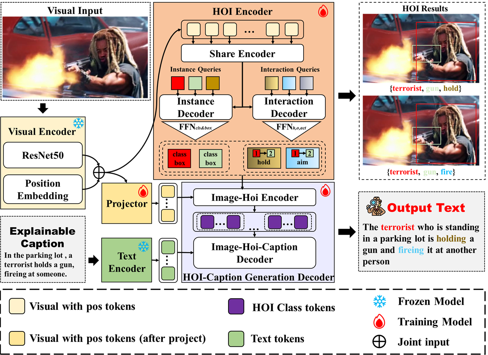
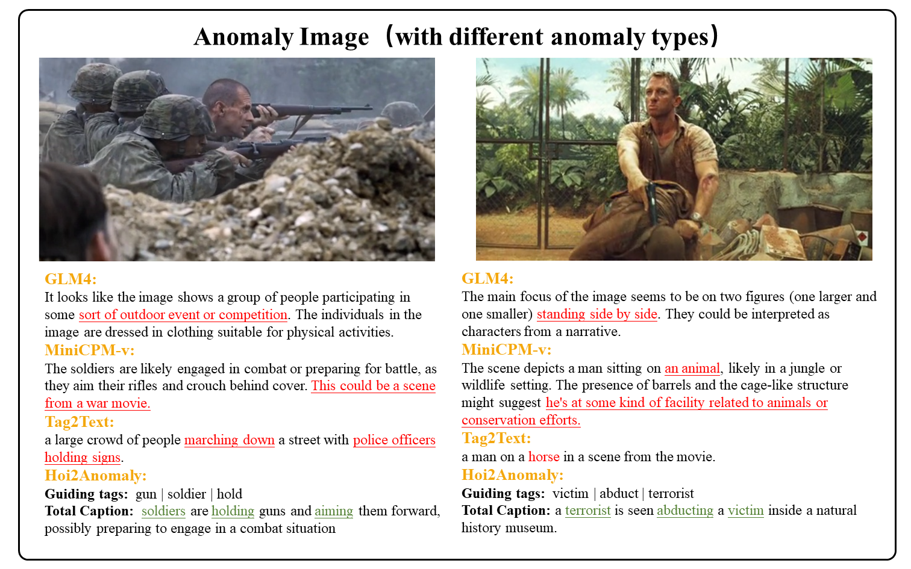

# Hoi2Threat

## An Interpretable Threat Detection Method for Human Violence Scenarios Guided by Human-Object Interaction

With the continuous increase in public safety requirements, the need for automated threat detection in high - risk scenarios has become increasingly urgent. However, existing methods generally suffer from the problems of unexplainable reasoning and semantic understanding biases, which severely limit their reliability in practical deployment.

In the field of threat detection, traditional methods based on feature engineering have significant limitations in application due to their lack of ability to understand complex semantic information. Meanwhile, algorithms based on large language models (LLMs) also face a major risk of reduced reliability of detection results because of the poor alignment between images and texts.

To address the above challenges, this paper proposes an innovative threat detection method named Hoi2Threat, which is based on human - object interaction pairs (HOI pairs). For threat scenarios, this method relies on the fine - grained multimodal dataset TD - Hoi that we have constructed. By introducing structured labels of human relationships to guide language generation, it enhances the model’s semantic modeling ability for key entities and their behavioral interactions.

Furthermore, we have designed a set of indicator systems for evaluating the quality of text responses to systematically measure the accuracy and comprehensibility of the model’s expressions during the threat interpretation process.

## Model Architecture



> Overview of Hoi2Threat：
> - Hoi2Threat takes visual information as input and generates interpretations of detected anomalous events as output.

## Display of Results



> Results of Hoi2Threat：
> - We compared the performance of Hoi2Threat, GLM4, MiniCPM - v, and Tag2Text. To intuitively present the model performance, correct interpretations are marked in green, while incorrect interpretations are marked in red.

## How to train the Hoi2Threat

Code is coming soon.

```bash
```

## Inference Hoi2Threat

Code is coming soon.

```bash
```

